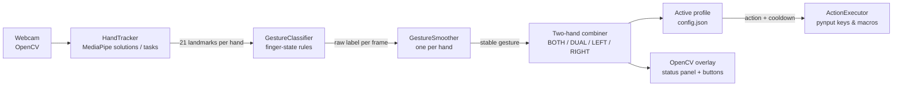

# hand_gesture_control

Control your desktop with hand gestures from a regular webcam: MediaPipe finds the hand,
a rule-based classifier names the gesture, and the app presses the keys (or runs the macro)
you mapped to it. Works on Linux and Windows.

[](https://github.com/MaciejZiel/hand_gesture_control/actions/workflows/ci.yml)
[](LICENSE)


<!-- TODO: add a short demo GIF (docs/demo.gif) recorded with the webcam preview,
     showing a gesture and the triggered action in the status panel. -->

## What it does

- Tracks up to two hands in the webcam feed and recognises 11 single-hand gestures
  (open palm, fist, pinch, OK sign, thumb up/down, 1-4 fingers, "rock") from 21 hand landmarks.
- Combines both hands into `BOTH_*`, `DUAL_<LEFT>_<RIGHT>`, `LEFT_*` and `RIGHT_*` gestures,
  so two-handed combinations can have their own bindings.
- Maps gestures to key presses, shortcuts (`CTRL+SHIFT+P`), media keys or macros
  (`CTRL+L;TEXT:hello;ENTER`), grouped into switchable profiles (e.g. Spotify, presentation).
- Debounces noisy per-frame predictions (voting window + minimum hold time + hysteresis
  on switching + cooldown) so a gesture fires once, not 30 times per second.
- Ships with a calibration mode, live overlay with on-screen buttons, `--dry-run`,
  headless mode, hot config reload, event logging and a Linux autostart script.

## Architecture



`main.py` owns the capture loop and UI; the classifier and smoother are pure Python with no
camera or MediaPipe dependency, which is what the tests exercise.

## Tech stack

Python 3.10+, MediaPipe (Hands legacy API or Tasks `HandLandmarker`), OpenCV, pynput,
pytest, ruff, black, GitHub Actions.

## Quick start

Requires a webcam.

```bash
python -m venv .venv
source .venv/bin/activate          # Windows: .venv\Scripts\activate
pip install -r requirements.txt

# Python 3.12+: mediapipe has no legacy `solutions` API, download the Tasks model first
# (see "MediaPipe backend" below), then:
python -m hand_gesture_control --dry-run --backend tasks
```

`--dry-run` prints the actions instead of pressing keys, which is the safest way to try it.
Close the window with `q` or `Esc`.

Other modes:

```bash
python -m hand_gesture_control                 # live, sends key presses
python -m hand_gesture_control --headless      # no preview window
python -m hand_gesture_control --paused        # start with actions paused
python -m hand_gesture_control --profile spotify
python -m hand_gesture_control --calibrate --backend tasks   # tune thumb/pinch thresholds
```

Keys in the preview window: `s` pause/resume, `r` reload `config.json`, `p` next profile,
`1`-`9` select profile.

## Tests

```bash
pip install -r requirements-dev.txt
pytest          # 12 tests
ruff check . && black --check .
```

The tests feed synthetic landmark sets to the classifier (one per gesture) and drive the
smoother with explicit timestamps, so they run without a camera. CI runs lint and tests on
Python 3.10 and 3.12.

## Key technical decisions

- **Rule-based classifier instead of a trained model.** Each finger is "extended" when
  tip, PIP and MCP joints are ordered along the y axis; the thumb and pinch use distances
  normalised by palm size (wrist to middle-finger MCP), so they do not depend on how far the
  hand is from the camera. No dataset or training is needed and every decision is explainable;
  the cost is sensitivity to hand rotation, which calibration only partly compensates for.
- **Temporal smoothing as a separate, testable component.** Per-frame labels flicker. The
  smoother requires a majority in a sliding window, a minimum number of frames *and* a minimum
  hold time, holds the gesture longer when switching to a different one (hysteresis), and
  keeps the last gesture briefly when the hand disappears. Timestamps are injectable, so the
  logic is unit-tested deterministically.
- **Two MediaPipe backends behind one tracker interface.** Newer `mediapipe` wheels for Python
  3.12+ drop the legacy `solutions` API, so `HandTracker` falls back to the Tasks API (which needs
  a `.task` model file) and normalises both outputs to the same landmark objects.
- **All behaviour in `config.json`.** Bindings, profiles, thresholds and UI settings are data,
  reloadable at runtime with `r`, so changing what a gesture does needs no code change.

## Limitations / next steps

- Gestures are judged from 2D image coordinates assuming an upright hand; strongly rotated or
  sideways hands are misclassified.
- Key injection goes through pynput, which does not work under Wayland without XWayland and
  may need accessibility permissions on macOS (macOS is untested).
- Only the classifier and smoother are covered by tests; the capture loop in `main.py` is large
  and would benefit from being split so action resolution and the two-hand combiner can be tested.
- Possible next steps: system tray control, a learned classifier (e.g. k-NN on landmarks) for
  custom gestures, profile import/export.

## Reference

### MediaPipe backend

By default, `backend=auto`:

- If `mediapipe` provides `solutions`, the app uses the legacy API (simplest setup).
- If `solutions` is not available, it uses `tasks` and requires a `hand_landmarker.task` model.

On Python 3.12/3.13, `mediapipe` usually does not include `solutions`, so you need the model.
Set `task_model_path` in `config.json` (default: `models/hand_landmarker.task`) or pass
`--model`.

Example model download (Linux/macOS):

```bash
mkdir -p models
python - <<'PY'
import pathlib
import urllib.request

url = "https://storage.googleapis.com/mediapipe-models/hand_landmarker/hand_landmarker/float16/latest/hand_landmarker.task"
path = pathlib.Path("models/hand_landmarker.task")
path.parent.mkdir(parents=True, exist_ok=True)
urllib.request.urlretrieve(url, path)
print("Saved", path)
PY
```

### Configuration

Use the `config.json` file in the project directory.

Most important fields:

- `gesture_to_action`: gesture-to-key mapping
- `gesture_window_size` and `gesture_min_votes`: gesture stabilization
- `gesture_min_stable_time`, `gesture_min_frames`: time and frame count required to accept a gesture
- `gesture_switch_multiplier`: extra hold time when switching gestures
- `gesture_unknown_timeout`: how long to keep the last gesture when the hand disappears
- `thumb_extended_ratio`, `pinch_ratio`, `thumb_up_down_threshold`: classification thresholds
- `cooldown_seconds`: delay between triggers
- `backend`: `auto` / `solutions` / `tasks`
- `task_model_path`: path to `hand_landmarker.task` (for `tasks`)
- `camera_width` / `camera_height`: force camera resolution
- `max_num_hands`: 1 or 2 (default: 2)
- `headless`: `true`/`false` (run without a window)
- `start_paused`: start in paused mode (does not send actions)
- `fullscreen`: `true`/`false` (fullscreen mode)
- `windowed_fullscreen`: `true`/`false` (full-screen-sized window with visible controls)
- `windowed_margin`: how many pixels to subtract from height (for the window bar)
- `display_width` / `display_height`: display size (for example `2880x1800`)
- `overlay_scale`: `auto` or a number (for example `1.0`, `1.2`) for UI scale
- `overlay_alpha`, `overlay_padding`, `overlay_line_gap`: status panel appearance
- `landmark_scale`: hand landmark icon scale (points/lines)
- `controls_enabled`: show on-screen buttons
- `controls_position`: `right` / `top-right` / `top-left`
- `controls_scale`, `controls_alpha`, `controls_margin`, `controls_gap`: on-screen button appearance
- `active_profile`: active profile (for example `default`)
- `profiles`: sets of gesture-to-action mappings
- `log_enabled`: write events to a file
- `log_mode`: `actions` / `active` / `all`
- `log_path`: log file path (for example `logs/gesture_events.log`)

Action examples:

- `SPACE`, `LEFT`, `RIGHT`, `UP`, `DOWN`
- `M`
- `CTRL+SHIFT+P`
- `VOLUME_UP`, `VOLUME_DOWN` (works if the system supports media keys)

Macros (sequences):

- `CTRL+L;TEXT:hello;ENTER`
- `DELAY:0.3;SPACE`

You can also use a JSON list:

```json
"OPEN_PALM": ["CTRL+L", "TEXT:hello", "ENTER"]
```

### Gestures

- `OPEN_PALM`
- `FOUR_FINGERS`
- `FIST`
- `INDEX_UP`
- `TWO_FINGERS`
- `THREE_FINGERS`
- `ROCK` (index + pinky)
- `OK_SIGN`
- `PINCH`
- `THUMB_UP` / `THUMB_DOWN` (or `THUMB` as a fallback)

Two-hand gestures:

- When both hands have the same stable gesture, the active gesture is named `BOTH_<GESTURE>`
  (for example `BOTH_OPEN_PALM`, `BOTH_FIST`).
- When both hands have different gestures: `DUAL_<LEFT>_<RIGHT>` (for example `DUAL_FIST_OPEN_PALM`)
- When only one hand is stable while two hands are visible: `LEFT_<GESTURE>` or `RIGHT_<GESTURE>`

### Profiles

You can define multiple profiles (for example Spotify/YouTube/Presentation).

Example in `config.json`:

```json
"active_profile": "default",
"profiles": {
  "default": {
    "gesture_to_action": { "OPEN_PALM": "SPACE" }
  },
  "spotify": {
    "gesture_to_action": { "OPEN_PALM": "SPACE", "TWO_FINGERS": "LEFT" }
  }
}
```

Profile switching:

- `p` key (cycle)
- `1-9` keys (select profile by order)
- `PROF` on-screen button (if `controls_enabled=true`)
- `--profile <name>` on startup

Quick controls:

- `s` - pause/resume actions
- `r` - hot reload `config.json`

UI buttons:

- `PAUSE` / `RUN` - pause/resume
- `CFG` - reload configuration

### Logging

Enable in `config.json`:

```json
"log_enabled": true,
"log_mode": "actions",
"log_path": "logs/gesture_events.log"
```

### Autostart (Linux)

```bash
bash scripts/install_autostart_linux.sh   # adds ~/.config/autostart/hand_gesture_control.desktop
bash scripts/remove_autostart_linux.sh
```

## License

MIT, see [LICENSE](LICENSE).
